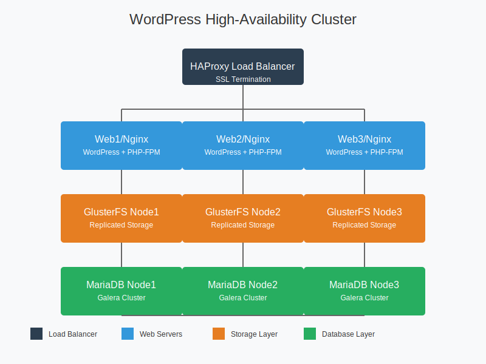
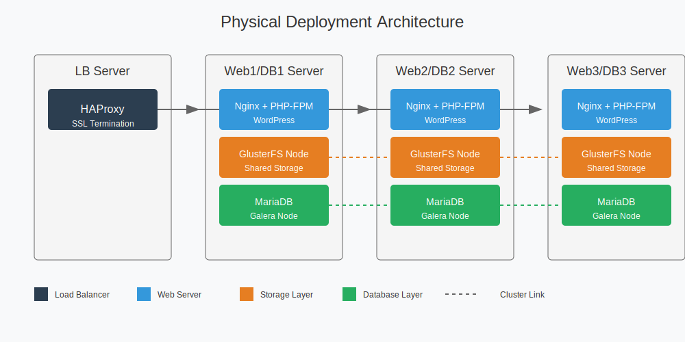

# High-Availability WordPress Cluster on Hetzner Cloud

This repository contains Infrastructure as Code (IaC) and configuration management for deploying a highly available WordPress cluster on Hetzner Cloud. The setup ensures WordPress application and database layer survive and remain operational even if any server (except the load balancer) crashes. It is interview task for Senec thus user and URL are from senecops.com.

## Table of Contents
- [Task Definition](#task-definition)
- [Overview](#overview)
- [Architecture](#architecture)
- [Prerequisites](#prerequisites)
- [Repository Structure](#repository-structure)
  - [Directory Layout](#directory-layout)
  - [Salt States](#salt-states)
  - [Terraform Modules](#terraform-modules)
- [Quick Start](#quick-start)
- [Usage](#usage)
  - [Infrastructure Management](#infrastructure-management)
  - [Configuration Management](#configuration-management)
  - [Server Access](#server-access)
  - [Service Management](#service-management)
- [Infrastructure Components](#infrastructure-components)
  - [Load Balancer](#load-balancer)
  - [Web Servers](#web-servers)
  - [Database Cluster](#database-cluster)
  - [Shared Storage](#shared-storage)
- [Maintenance](#maintenance)
- [Backup and Recovery](#backup-and-recovery)
- [Troubleshooting](#troubleshooting)
- [Contributing](#contributing)
- [License](#license)

## Task Definition
4 servers should be set up via terraform according to the following settings.

| Resource      | #1            | #2      | #3      | #4      |
|--------------|--------------|---------|---------|---------|
| Server-Name  | web1         | web2     | web3     | LB      |
| Type         | CX22         | CX22     | CX22     | CX22    |
| IPv4 (internal) | 10.0.0.1  | 10.0.0.2 | 10.0.0.3 | 10.0.0.4 |
| IPv4 (extern)| - | -       | -       | 162.55.156.131       |

### Tasks

1. Please create a git repository for the automation that builds the following setup
automatically.
2. For the initial deployment, create a reusable module that deploys the setup, and call it
from elsewhere in the repository.
3. Document the module in a way that someone who is passingly familiar with terraform or
ansible is able to understand and use it.
4. The high level goal is to deploy a redundant Wordpress cluster (PHP application &
database). You are totally free to choose the tools and architecture to make that happen.
The load balancer is the only instance allowed to fail which brings the service down. Any
other single server failure must not bring the service down. The load balancer should
handle SSL termination. A certificate should be provided using Let's Encrypt. The FDQN
for the service should be/is http://wordpress-vl.senecops.com which means the service
should work in a browser through https://wordpress-vl.senecops.com
5. please deposit SSH key on the servers

## Overview

This project implements a fault-tolerant WordPress cluster using:
- Terraform for infrastructure provisioning on Hetzner Cloud
- SaltStack for configuration management and server bootstrapping
- HAProxy for load balancing and SSL termination
- Nginx as the web server
- GlusterFS for distributed file storage
- Galera MariaDB cluster for database high availability

## Architecture

The infrastructure consists of two primary architectural views: logical and physical.

### Logical Architecture

The logical architecture shows how the services are organized conceptually, with each component being a logical service independent of its physical location:



### Physical Architecture
The physical architecture shows the actual deployment across the four servers, including component co-location:


1. Load Balancer Server
   - HAProxy
     * HTTP: Port 80
     * HTTPS: Port 443
     * Statistics Page: Port 8404
   - SSL Termination point for HTTPS traffic

2. Web/DB Servers (web1, web2, web3)
   Each server hosts:
   - Nginx + PHP-FPM
     * HTTP: Port 80
   - GlusterFS Node
     * Management: Port 24007
     * Brick ports: 49152-49251
   - MariaDB (Galera Cluster)
     * MySQL: Port 3306
     * Galera Replication: Ports 4567, 4568
     * State Snapshot Transfer: Port 4444

### Network Connectivity
- Load balancer connects to all web servers on HTTP port 80
- GlusterFS nodes form a distributed storage cluster
- MariaDB nodes form a Galera cluster for synchronous multi-master replication
- Internal network allows all necessary ports between nodes

### High Availability Features
- Load Balancer: Distributes traffic and handles SSL termination
- Web Layer: Multiple Nginx servers running WordPress
- Storage Layer: GlusterFS provides replicated storage across all nodes
- Database Layer: Galera cluster ensures synchronous replication and automatic failover

## Prerequisites

- Hetzner Cloud account and API token
- Hetzner Floating IP address and DNS record (domain setting) pointing to it
- Terraform >= 1.0.0
- rsync
- make
- SSH key pair for server access

## Repository Structure

### Directory Layout

```
├── diagrams
│ ├── logical-architecture.svg
│ └── physical-architecture.svg
├── gen_tf.py
├── Makefile
├── Readme.md
├── salt
│ ├── pillar
│ │ ├── senec.sls
│ │ └── top.sls
│ └── salt
│     ├── common.sls
│     ├── enable_salt_mine
│     │ └── init.sls
│     ├── gluster
│     │ ├── create_volume.sls
│     │ ├── install.sls
│     │ ├── mount.sls
│     │ └── peer.sls
│     ├── haproxy
│     │ ├── config.sls
│     │ ├── deploy_ssl.sls
│     │ ├── files
│     │ │ └── haproxy.cfg.j2
│     │ ├── init.sls
│     │ └── install.sls
│     ├── mariadb
│     │ ├── backup.sls
│     │ ├── bootstrap.sls
│     │ ├── files
│     │ │ └── galera.cnf.j2
│     │ ├── firewall.sls
│     │ ├── galera.sls
│     │ ├── install.sls
│     │ ├── secure_root.sls
│     │ ├── service.sls
│     │ └── status.sls
│     ├── mount_volumes
│     │ └── init.sls
│     ├── nginx
│     │ ├── config.sls
│     │ ├── files
│     │ │ └── wordpress.conf.j2
│     │ ├── init.sls
│     │ └── install.sls
│     ├── orch
│     │ └── deploy.sls
│     ├── ssl
│     │ └── init.sls
│     ├── top.sls
│     ├── update_hosts
│     │ └── init.sls
│     └── wordpress
│         ├── cli.sls
│         ├── config.sls
│         ├── db.sls
│         ├── deps.sls
│         ├── download.sls
│         ├── files
│         │ └── wp-config.php.j2
│         ├── finalize.sls
│         └── install.sls
└── terraform
    ├── environments
    │ └── test
    │     ├── main.tf
    │     ├── outputs.tf
    │     ├── provider.tf
    │     └── variables.tf
    └── modules
        ├── firewall
        │ ├── main.tf
        │ ├── outputs.tf
        │ ├── provider.tf
        │ └── variables.tf
        ├── network
        │ ├── main.tf
        │ ├── outputs.tf
        │ ├── provider.tf
        │ └── variables.tf
        ├── server
        │ ├── cloud-init.tpl
        │ ├── main.tf
        │ ├── outputs.tf
        │ ├── provider.tf
        │ └── variables.tf
        └── volume
            ├── main.tf
            ├── outputs.tf
            ├── provider.tf
            └── variables.tf

```

### Salt Configuration

#### Pillar Configuration
The entire stack configuration is centralized in `pillar/senec.sls`, which defines all key parameters for the infrastructure:
* Infrastructure settings
  * Terraform.tfvars settings
  * Servers type, locations, IPs and roles
  * SSH keys
  * Network information
  * Firewall rules
* Common Settings
  * Mounted volume paths
  * Web server configurations
  * Domain settings and admin contact

* GlusterFS Configuration
  * Package definitions
  * Peer configuration
  * Volume settings and mount points
  * Client/server setup

* MariaDB Cluster
  * Database server list
  * Root and application credentials
  * Service configuration
  * Backup directory locations

* WordPress Setup
  * Installation directory
  * Database connection details
  * Admin user configuration
  * Site settings

The pillar data is structured hierarchically under the 'senec' key and is used by various Salt states to maintain consistent configuration across the entire cluster. This centralized approach makes it easy to modify the stack configuration by updating a single file.

#### Secrets Management
> ⚠️ **Important Note**: This repository contains hardcoded secrets in the pillar file for demonstration purposes only. In a production environment, this is NOT a secure practice.

For a production deployment, secrets should be managed using:

* External Secret Management Systems
  * HashiCorp Vault
  * AWS Parameter Store
  * Azure Key Vault
  * GCP Secret Manager

* Best Practices for Production
  * Never commit secrets to version control
  * Use external secret stores with proper access controls
  * Implement secret rotation
  * Use separate secrets for different environments
  * Audit secret access

* Migration from Development
  1. Move all sensitive values to your chosen secret store
  2. Update pillar to reference external secrets
  3. Configure proper access controls
  4. Implement monitoring and auditing
  5. Set up secret rotation policies

#### Salt States

#### Core Components
* `common.sls`: Base system configurations
  * System packages
  * Basic configurations
  * Common utilities
* `enable_salt_mine/`: Server discovery configuration
  * Minion data sharing
  * Network discovery
  * Cluster communication
* `mount_volumes/`: Storage management
  * Volume mounting
  * Filesystem setup
  * Persistence configuration
* `update_hosts/`: Host management
  * Dynamic DNS updates
  * Hostname resolution
  * Cluster communication
* `ssl/`: Certificate management
  * SSL certificate deployment using Letsencrypt

#### Storage Layer
* `gluster/`: GlusterFS distributed storage
  * Volume creation and management
  * Installation and setup
  * Mount point configuration
  * Peer discovery and setup
  * Replication management
  * Volume optimization

#### Database Layer
* `mariadb/`: Galera cluster configuration
  * Base installation
  * Cluster bootstrapping
  * Backup procedures
  * Firewall configuration
  * Service management
  * Root security
  * Status monitoring

#### Web Layer
* `nginx/`: Web server configuration
  * Base installation
  * WordPress-specific server blocks
  * SSL integration

#### Load Balancer
* `haproxy/`: Load balancer configuration
  * Base installation and setup
  * SSL termination
  * Backend server management
  * Health check configuration
  * Statistics monitoring

#### Application Layer
* `wordpress/`: WordPress configuration
  * Core installation
  * Database integration
  * WP-CLI setup and configuration
  * Backup configuration

### Terraform Modules

* `environments/test/`: Test environment
  * Main infrastructure definition
  * Output configurations
  * Variable declarations
  * Provider settings
  * State management

* `modules/`: Infrastructure components
  * `firewall/`: Network security
    * Inbound/outbound rules
    * Service access control
    * Network isolation
  * `network/`: Network configuration
    * Subnet management
  * `server/`: Compute resources
    * Instance provisioning
    * Cloud-init configuration
    * Resource allocation
    * Metadata management
  * `volume/`: Storage resources
    * Volume provisioning
    * Attachment management

## Quick Start

1. Clone the repository:
```bash
git clone git@github.com:vlebo/hetzner_wp_cluster.git
```

2. View available commands:
```bash
make help
```
```bash
Available commands: 
help                  | Show this help.
plan                  | Run terraform plan
apply                 | Run terraform apply
destroy               | Destroy Terraform infrastructure  (asks for confirmation)
test                  | Run test to see if all servers are available
dns                   | Update internal DNS on all servers
upload                | Upload Salt files to /srv/ on the remote host
ssh                   | SSH into LB, web1, web2, or web3 via $(REMOTE_HOST) as a jumpbox (usage: make ssh TARGET=web1)
deploy                | Deploy everything
reboot                | Reboot LB, web1, web2, or web3 (usage: make reboot TARGET=web1)
service               | Start|Stop|Restart nginx|php8.1-fpm|mariadb on web1|web2|web3 (usage: make service ACTION=stop SERVICE=nginx TARGET=web1)
dbstatus              | Run queries to check DB cluster status
```

3. Set up environment variables and prerequisites:
```bash
export TF_VAR_hcloud_token="your-hetzner-token"
```
Set your `domain`, `lb_floating_ip` and `ssh_public_keys` name in `salt/pillar/senec.sls`.

Update any other information you want like paths or usernames and passwords.

## Usage

### Infrastructure Management
```bash
# Generate terraform.tfplan and .env file
make gentf

# View planned changes
make plan

# Apply infrastructure changes
make apply
```
NOTE: since there is a server upgrade happening and some packages are being installed using cloud-init during initial boot it might take few minutes complete the initial setup.

### Configuration Management
```bash
# Test server availability
make test

Running test.ping... 
web2:
    True
web3:
    True
LB:
    True
web1:
    True

All servers should return `True`
```
Then
```bash
# Upload Salt files to /srv/ on the remote host
make upload

# Update internal DNS on all servers
make dns
```
You should see all IPs and hosts added to /etc/hosts file. 
```bash
10.0.0.4  LB
10.0.0.5  web1
10.0.0.2  web2
10.0.0.3  web3
```

```bash
# Deploy all configurations
make deploy
```
After `deploy` is done you should be able to access your Wordpress installation on the domain/URL you set up previously.

### Server Access
```bash
# SSH into a specific server
make ssh TARGET=web1
make ssh TARGET=web2
make ssh TARGET=web3
make ssh TARGET=lb

# Reboot a specific server
make reboot TARGET=web1
make reboot TARGET=web2
make reboot TARGET=web3
make reboot TARGET=lb
```

### Service Management
```bash
# Control services on specific servers
# Available services: nginx, php8.1-fpm, mariadb
# Available actions: start, stop, restart
# Available targets: web1, web2, web3

# Examples:
make service ACTION=stop SERVICE=nginx TARGET=web1
make service ACTION=restart SERVICE=php8.1-fpm TARGET=web2
make service ACTION=start SERVICE=mariadb TARGET=web3
```

## Infrastructure Components

### Load Balancer
- HAProxy for HTTP/HTTPS traffic distribution
- SSL termination
- Database connection load balancing
- Health checks for backend servers

### Web Servers
- Three Nginx web servers
- WordPress application layer
- Shared storage through GlusterFS
- PHP-FPM configuration

### Database Cluster
- Galera MariaDB cluster
- Multi-master replication
- Automatic failover
- Consistent data across nodes

### Shared Storage
- GlusterFS distributed filesystem
- Replicated across web servers
- WordPress uploads and content consistency
- Volume management

## Backup

Backup strategy:
- Database dumps
- Automated scheduling

## Troubleshooting

### Load Balancer Issues
* HAProxy Connection Problems
  * Check HAProxy service status: `make service ACTION=status SERVICE=haproxy TARGET=lb`
  * Verify SSL certificate validity and paths
  * Check backend server health status in HAProxy stats page
  * Review HAProxy logs: `/var/log/haproxy.log`

* SSL Termination Issues
  * Verify certificate paths in HAProxy configuration
  * Check certificate expiration dates
  * Ensure proper certificate chain is in place
  * Review SSL configuration in HAProxy

### Database Cluster
* Cluster Health Check
  * Use built-in health check command:
    ```bash
    make dbstatus
    ```
  * This command checks:
    - Cluster size (should be 3)
    - Cluster status
    - List of active cluster members
  * Use this command to quickly verify cluster health and membership

* Node Synchronization and Recovery
  * In case of node failure:
    1. Check which node is down using `make dbstatus`
    2. Verify network connectivity to the failed node
    3. Check MariaDB service status on the node:
       ```bash
       make service ACTION=status SERVICE=mariadb TARGET=web1
       ```
    4. Review error logs for failure cause
    5. Restart the service if needed:
       ```bash
       make service ACTION=restart SERVICE=mariadb TARGET=web1
       ```

* Common Issues
  * Node not joining cluster
    - Check node's error logs
    - Verify network connectivity
    - Review disk space and memory usage
  * Cluster state mismatch
    - Use `make dbstatus` to verify cluster membership
    - Check individual node statuses
    - Ensure required ports are open (3306, 4567, 4568, 4444)

### Storage Problems
* GlusterFS Issues
  * Volume status check: `gluster volume status`
  * Check peer connectivity: `gluster peer status`
  * Verify brick status and healing
  * Common commands:
    ```bash
    # Check volume health
    gluster volume heal <volume-name> info
    
    # Force synchronization
    gluster volume heal <volume-name> full
    ```

* Mount Point Problems
  * Verify mount points in `/etc/fstab`
  * Check filesystem errors
  * Review permissions and ownership
  * Debug commands:
    ```bash
    # Check mount status
    mount | grep gluster
    
    # Remount volumes
    mount -a
    ```

### WordPress Application
* PHP-FPM Issues
  * Check PHP-FPM service status
  * Review error logs: `/var/log/php-fpm/error.log`
  * Verify PHP configuration
  * Monitor PHP process usage

* WordPress Content Sync
  * Verify GlusterFS mount points
  * Check file permissions
  * Review WordPress debug log
  * Clear WordPress cache

### Network Connectivity
* Internal DNS Resolution
  * Verify hosts file configuration
  * Check DNS resolution between nodes
  * Test internal network connectivity
  * Debug commands:
    ```bash
    # Test connectivity
    make test

    # Update DNS
    make dns
    ```

* Firewall Issues
  * Review firewall rules status
  * Check required ports accessibility
  * Verify security group configurations
  * Common ports to check:
    - HAProxy: 80, 443
    - MariaDB: 3306, 4567, 4568, 4444
    - GlusterFS: 24007, 24008, 49152-49251

### Performance Issues
* Slow Website Response
  * Check server load averages
  * Monitor MySQL query performance
  * Review Nginx access/error logs
  * Verify caching configuration

* Resource Constraints
  * Monitor CPU usage
  * Check available memory
  * Verify disk space usage
  * Review system logs for bottlenecks
